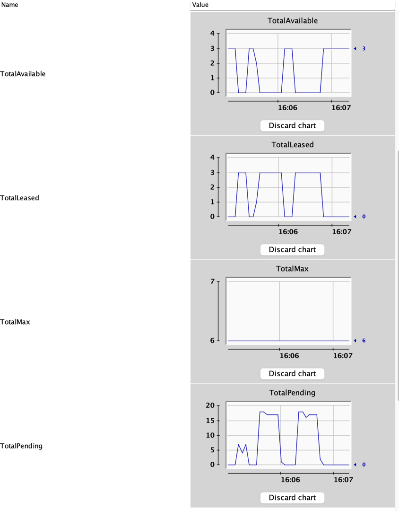

# Http Client Monitor
Demo of monitoring Http Clients (just Apache Http Client for now). MBean and test services.

Http connection pool settings and usage statistics; socket and request configuration are exposed through JMX with MBeans, e.g. visible in VisualVM.

Example view in VisualVM:

You can add more logging by switching to DEBUG level (application.properties.)

We have two services, both have endpoints: /greetingMany and /hello. 
1. Build with `./mvnw compile`
2. Start service 1 and 2 in two consoles by:
`./run 8080`
`./run 8081`

3. Call `/greetingMany` on service 1 by:
`curl "localhost:8080/greetingMany?threads=10"`
where `threads` is the number of rest calls made by `/greetingMany` to `/hello`.

4. Monitor service 1 with e.g. VisualVm MBean browser, under com.jpinpoint.monitor. 
You can see dynamic behavior of the pool usage for the total pool and per route: 
* leased: connections in use
* pending: connections requests waiting for a connection from the pool
* available: free connections in the pool
* max: configured maximum number of connection in the pool.

Depending on sleep time of /hello, number of parallel /hello calls (threads), connection pool size (per route) and timeout values, 
a TimeoutException may be thrown and logged, resulting in not all /hello calls actually being executed.

Note: using a VPN may interfere with local attach by a JMX client to a service. You may need to switch off your VPN.

(Part of the code is based on Spring's gs-rest-service.)
